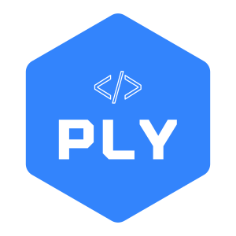

<p align="center"></p>

# What is Ply ?

Ply is a Go module made to easily create and **compose** your HTML page by just writing HTML.

## Install

```bash
go get github.com/dnazirso/ply
```

# Usage

## Example

folder structure example:

```
.
├── main.go
├── components/
│   └── hello.html
└── pages/
    └── index.html
```

main.go

```go
package main

import (
	"html/template"
	"net/http"

	"github.com/dnazirso/ply"
)

func hello(w http.ResponseWriter, r *http.Request) {
	type Hello struct {
		Hello string
	}

	tmpl, _ := template.New("index").Parse(ply.Fold("pages/index", ""))

	data := Hello{
		Hello: "Hello"
	}

	tmpl.Execute(w, data)
}

func main() {
	http.HandleFunc("/", hello)

	http.ListenAndServe(":8080", nil)
}
```

pages/index.html

```html
<!doctype html>
<html lang="en">
	<head>
		<title>Your APP</title>
	</head>
	<body>
		<ply as="components/hello">World !</ply>
	</body>
</html>
```

components/hello.html

```html
<p>{{.Hello}} {{.Children}}</p>
```

## How does it works ?

### Ply Tag

Pretty straight forward :

You need a `<ply as="path/to/your/component"></ply>` tag in your template!

and call the `ply.Fold()` method to parse your template : 
```go
tmpl, _ := template.New("index").Parse(ply.Fold("path/to/my/template", ""))
```

### Children

You can pass a children to your ply components.

```html
<ply as="path/to/your/component">
	<div class="whatever">This as child</div>
</ply>
```

Place the `{{.Children}}` in your component.

```html
<p>{{.Children}} place</p>
```

### Injection

The second argument of the `ply.Fold()` method represents the `{{.Children}}` of your template. It can be populated by whatever you need as a string.

If you need a template taking place of a `{{.Children}}` space within another template, it is possible to inject a Go template into another Go template as a string.

```Go
inner_tmpl, _ := template.New("index").Parse(ply.Fold("inner", ""))
inner_as_string := inner_tmpl.Tree.Root.String()

outer_tmpl, _ := template.New("index").Parse(ply.Fold("outer", inner_as_string))
```

### Composition

You can compose you plies as you wish

```html
<ply as="path/to/a/component">
	<ply as="another/one">
		<ply as="another/one">but with a child</ply>
		<ply as="yet/another/component"></ply>
		<ply as="you/get/the">idea</ply>
	<ply>
</ply>
```

# Possibilities

At this stage you might have guessed that you can prepare your application however you'd like.

Having your `layout.html` loading things on the go while being a `<ply>` component itself.

views/layout.html:
```html
<!doctype html>
<html lang="en">
	<head>
		<title>Your APP</title>
	</head>
	<body>
		{{.Children}}
	</body>
</html>
```

views/landing.html:
```html
<ply as="views/layout">
	<ply as="views/hero"></ply>
	<h1>{{.Children}}<h1>
</ply
```

views/hero.html:
```html
<div class="hero">
	
</div>
```

landing.go
```go
func Landing(w http.ResponseWriter, r *http.Request) {
	landing, _ := template.New("landing").Parse(ply.Fold("landing", "Welcome"))

	tmpl.Execute(w, data)
}
```

result: 
```html
<!doctype html>
<html lang="en">
	<head>
		<title>Your APP</title>
	</head>
	<body>
		<div class="hero">
			
		</div>
		<h1>Welcome<h1>
	</body>
</html>

```

# What about API calls ?

One word : **[HTMX !!!](https://htmx.org/)**

You can go nut about using it. You have multiple possiblities of integration with **Ply**.

- Download and use as an asset
- Copy past the js in a `<script>` tag
- Copy past the js in a `<script>` tag as a `<ply>` template 
- CDN link in your `index.html`
- CDN link in your `<ply>` templates
- CDN link as a `<ply>` template

> **N.B:** Except for the first two solutions, the others are pointless or not recommended... but hey!... It's your app, I won't judge !
